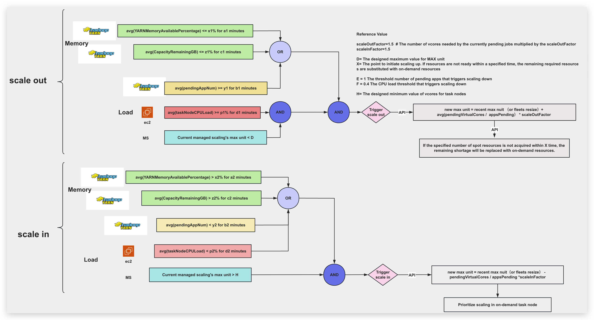

# managed-scaling-enhanced
An advanced version of managed scaling that dynamically adjusts resources to meet workload demands with improved efficiency and precision.


## 1. Enhanced Managed Scaling: Logic Flow Diagram


## 2. User Guide

### 2.1 Initialize the Parameter Store
Before using managed-scaling-enhanced, you need to initialize the Parameter Store.

```zsh
python create_parameter_store.py
```

Specific parameters
```python
    parameters = {
        f'{prefix}/minimumUnits': 320,  # max nuit 的最小值
        f'{prefix}/maximumUnits': 1000, # max nuit 的最大值

        f'{prefix}/spotInstancesTimeout': 60*30,
        f'{prefix}/monitorIntervalSeconds': 30,
        f'{prefix}/actionIntervalSeconds': 30,

        f'{prefix}/scaleOutAvgYARNMemoryAvailablePercentageValue': 33,
        f'{prefix}/scaleOutAvgYARNMemoryAvailablePercentageMinutes': 5,
        f'{prefix}/scaleOutAvgCapacityRemainingGBValue': 256,
        f'{prefix}/scaleOutAvgCapacityRemainingGBMinutes': 5,
        f'{prefix}/scaleOutAvgPendingAppNumValue': 3,
        f'{prefix}/scaleOutAvgPendingAppNumMinutes': 5,
        f'{prefix}/scaleOutAvgTaskNodeCPULoadValue': 60,
        f'{prefix}/scaleOutAvgTaskNodeCPULoadMinutes': 15,

        f'{prefix}/scaleInAvgYARNMemoryAvailablePercentageValue': 40,
        f'{prefix}/scaleInAvgYARNMemoryAvailablePercentageMinutes': 3,
        f'{prefix}/scaleInAvgCapacityRemainingGBValue': 512,
        f'{prefix}/scaleInAvgCapacityRemainingGBMinutes': 3,
        f'{prefix}/scaleInAvgPendingAppNumValue': 2,
        f'{prefix}/scaleInAvgPendingAppNumMinutes': 2,
        f'{prefix}/scaleInAvgTaskNodeCPULoadValue': 40,
        f'{prefix}/scaleInAvgTaskNodeCPULoadMinutes': 15,

        f'{prefix}/scaleOutFactor': 1.5,
        f'{prefix}/scaleInFactor': 1.7,   

        f'{prefix}/maximumOnDemandInstancesNumValue': 160,  # 针对defalut情况下：on_demand instance num = core node num   

        f'{prefix}/scaleOutCooldownSeconds': 60 * 7,
        f'{prefix}/scaleInCooldownSeconds': 60 * 5,      
    }
```
After execution, the parameter list can be seen in the Parameter Store.

You can create multiple distinct prefix parameters for configuring different clusters.

### 2.2. monitor
Before using managed-scaling-enhanced, first enable monitoring.


Two parameters are required: one is the cluster that needs to be monitored, and the other is the set of prefix parameters in the Parameter Store. 
You can initiate multiple monitoring processes, targeting different clusters with different configurations. 
This program saves the monitoring data in sqlite files named after the clusters, which are used for querying by the main program of managed-scaling-enhanced.
```zsh
$ python yarn_monitor.py --help                                                                
usage: yarn_monitor.py [-h] --emr-cluster-id EMR_CLUSTER_ID --prefix PREFIX

EMR YARN Metric Monitor

optional arguments:
  -h, --help            show this help message and exit
  --emr-cluster-id EMR_CLUSTER_ID
                        EMR cluster ID
  --prefix PREFIX       Parameter store prefix
```

### 2.3. managed-scaling-enhanced
Main program of Managed Scaling Enhanced

```zsh
$ python main.py --help                                                                    
usage: main.py [-h] --emr-id EMR_ID [--prefix PREFIX] [--spot-switch-on-demand SPOT_SWITCH_ON_DEMAND]

Managed Scaling Enhanced for EMR

options:
  -h, --help            show this help message and exit
  --emr-id EMR_ID       EMR cluster ID
  --prefix PREFIX       Parameter prefix (default: managedScalingEnhanced)
  --spot-switch-on-demand SPOT_SWITCH_ON_DEMAND
                        Whether to switch to on-demand instances (0: no, 1: yes, default: 0)
```
The main program will decide to scale out or scale in based on the logic of the architecture diagram, while also logging a record of the trigger time in sqlite for future condition judgment.

## appendix
### Core class logic

The logic of the `determine_scale_status` method is as follows:
a. Obtain the current cluster's `MaximumCapacityUnits` value.
b. Fetch related monitoring data from the SQLite database and CloudWatch metrics, including:

* `YARNMemoryAvailablePercentage` (used for scaling)
* `CapacityRemainingGB` (used for scaling)
* `PendingAppNum` (used for scaling)
* CPU utilization of task nodes (used for scaling, obtained through the `get_task_node_metrics` method)

c. If any of the monitoring data lists is empty, then return 0 (do not perform scaling operations).
d. Calculate the individual condition status for scaling out (`scaleOut`):

* `scaleOutMemoryConditionYARNMemoryAvailablePercentageStatus`: whether the average of `YARNMemoryAvailablePercentage` is below the threshold `scaleOutAvgYARNMemoryAvailablePercentageValue`
* `scaleOutMemoryConditionCapacityRemainingGBStatus`: whether the average of `CapacityRemainingGB` is below the threshold `scaleOutAvgCapacityRemainingGBValue`
* `scaleOutAppConditionPendingAppNumStatus`: whether the average of `PendingAppNum` is greater than or equal to the threshold `scaleOutAvgPendingAppNumValue`
* `scaleOutCPULoadStatus`: whether the average CPU utilization of task nodes is greater than or equal to the threshold `scaleOutAvgTaskNodeCPULoadValue`
* `scaleOutcurrentMaxUnitNumStatus`: whether the current `MaximumCapacityUnits` is less than `maximumUnits`

e. Calculate the comprehensive condition for scaling out:

* `scaleOutMemoryCondition`: `scaleOutMemoryConditionYARNMemoryAvailablePercentageStatus` or `scaleOutMemoryConditionCapacityRemainingGBStatus` is true
* `scaleOutPendingAppNumCondition`: `scaleOutAppConditionPendingAppNumStatus` is true
* `scaleOutCPULoadCondition`: `scaleOutCPULoadStatus` is true
* `scaleOutcurrentMaxUnitCondition`: `scaleOutcurrentMaxUnitNumStatus` is true
* `scaleOutCondition`: `scaleOutMemoryCondition` and `scaleOutPendingAppNumCondition` and `scaleOutCPULoadCondition` and `scaleOutcurrentMaxUnitCondition` are all true

f. Calculate the individual condition status for scaling in (`scaleIn`):

* `scaleInMemoryConditionYARNMemoryAvailablePercentageStatus`: whether the average of `YARNMemoryAvailablePercentage` is above the threshold `scaleInAvgYARNMemoryAvailablePercentageValue`
* `scaleInMemoryConditionCapacityRemainingGBStatus`: whether the average of `CapacityRemainingGB` is above the threshold `scaleInAvgCapacityRemainingGBValue`
* `scaleInAppConditionPendingAppNumStatus`: whether the average of `PendingAppNum` is less than the threshold `scaleInAvgPendingAppNumValue`
* `scaleInCPULoadStatus`: whether the average CPU utilization of task nodes is less than the threshold `scaleInAvgTaskNodeCPULoadValue`
* `scaleIncurrentMaxUnitNumStatus`: whether the current `MaximumCapacityUnits` is greater than `minimumUnits`

g. Calculate the comprehensive condition for scaling in:

* `scaleInMemoryCondition`: `scaleInMemoryConditionYARNMemoryAvailablePercentageStatus` or `scaleInMemoryConditionCapacityRemainingGBStatus` is true
* `scaleInPendingAppNumCondition`: `scaleInAppConditionPendingAppNumStatus` is true
* `scaleInCPULoadCondition`: `scaleInCPULoadStatus` is true
* `scaleIncurrentMaxUnitCondition`: `scaleIncurrentMaxUnitNumStatus` is true
* `scaleInCondition`: (`scaleInMemoryCondition` or `scaleInPendingAppNumCondition` or `scaleInCPULoadCondition`) and `scaleIncurrentMaxUnitCondition` are all true

h. Determine the scaling operation based on the values of `scaleOutCondition` and `scaleInCondition`:

* If `scaleOutCondition` is true and `scaleInCondition` is false, then return 1 (perform scaling out)
* If `scaleOutCondition` is false and `scaleInCondition` is true, then return -1 (perform scaling in)
* Otherwise return 0 (do not perform scaling operations)


The logic of the `scale_out` method is as follows:
First, check if it is within the cooldown period, if so, skip the scaling out operation.
a. Obtain the current cluster's `pendingVirtualCores` and `appsPending` metrics.
b. If `appsPending` is 0, then return directly, do not perform scaling out operation.
c. Obtain the current Managed Scaling policy, including `MaximumCapacityUnits` and `MinimumCapacityUnits`.
d. Calculate the new `MaximumCapacityUnits` value, formula is:
`new_max_capacity_units = current_max_capacity_units + int((pending_virtual_cores / apps_pending) * self.scaleOutFactor)`
e. Ensure the new `MaximumCapacityUnits` value is greater than or equal to `MinimumCapacityUnits + 1`.
f. Ensure the new `MaximumCapacityUnits` value does not exceed the maximum limit of `self.maximumUnits`.
g. Update the `MaximumCapacityUnits` in the current policy to the newly calculated value.
h. Use the updated policy to call the `emr_client.put_managed_scaling_policy` method to apply the new policy.
i. Record the new policy's `MaximumCapacityUnits` value to the SQLite database.
j. If `self.spot_switch_on_demand` is 1, then check if it is necessary to supplement On-Demand instances. The specific method is:

* Obtain the minimum `MaximumCapacityUnits` value within the past `self.spotInstancesTimeout` seconds from the SQLite database.
* If this minimum value is greater than the totalVirtualCores of the current cluster, then it is necessary to supplement On-Demand instances.
* Calculate the number of On-Demand instances needed.
* Update the `MaximumOnDemandCapacityUnits` in the current policy.
* Apply the updated policy.


The logic of the `scale_in` method is as follows:
First, check if it is within the cooldown period, if so, skip the scaling in operation.
a. Obtain the current cluster's `pendingVirtualCores` and `appsPending` metrics.
b. Obtain the current Managed Scaling policy, including `MaximumCapacityUnits` and `MaximumCoreCapacityUnits`.
c. If `appsPending` is 0, then set `MaximumCapacityUnits` to `self.minimumUnits`, and set `MaximumOnDemandCapacityUnits` to `self.maximumOnDemandInstancesNumValue`.
d. If `appsPending` is not 0, then:

* Set `MaximumOnDemandCapacityUnits` to `self.maximumOnDemandInstancesNumValue`.
    * To maintain consistency with the original OnDemand settings, solving the adjustment issue of this value during the scaling out phase.
* Calculate the new `MaximumCapacityUnits` value, formula is:
    `new_max_capacity_units = max(self.minimumUnits, current_max_capacity_units - int((pending_virtual_cores / apps_pending) * self.scaleInFactor))`
* Update the `MaximumCapacityUnits` in the current policy to the newly calculated value.

e. Use the updated policy to call the `emr_client.put_managed_scaling_policy` method to apply the new policy.
f. Record the new policy's `MaximumCapacityUnits` value to the SQLite database.
g. Obtain the list of Instance Fleets for the current cluster.
h. For each Instance Fleet of type TASK:

* Set its `TargetOnDemandCapacity` to 0.
* Set its `TargetSpotCapacity` to `MaximumCapacityUnits - MaximumCoreCapacityUnits`.
* Call the `emr_client.modify_instance_fleet` method to apply the changes.


### Performance Comparison Between Synchronous and Asynchronous Calls

Asynchronous call is 38.43% faster.


