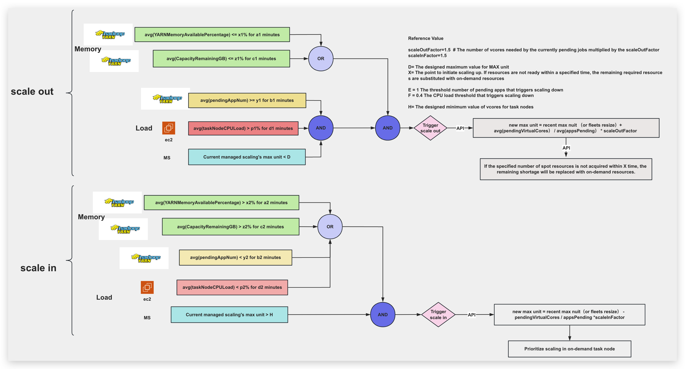
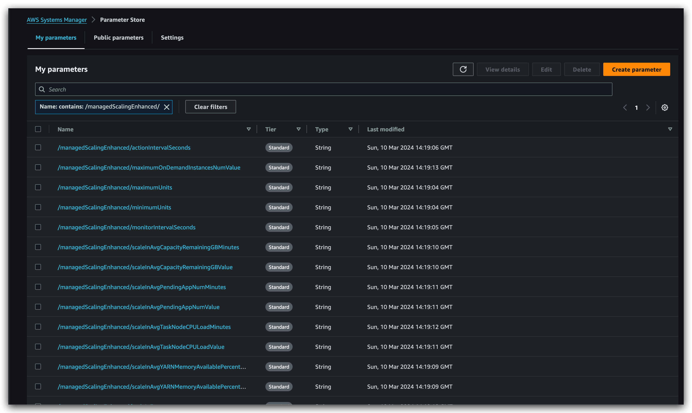
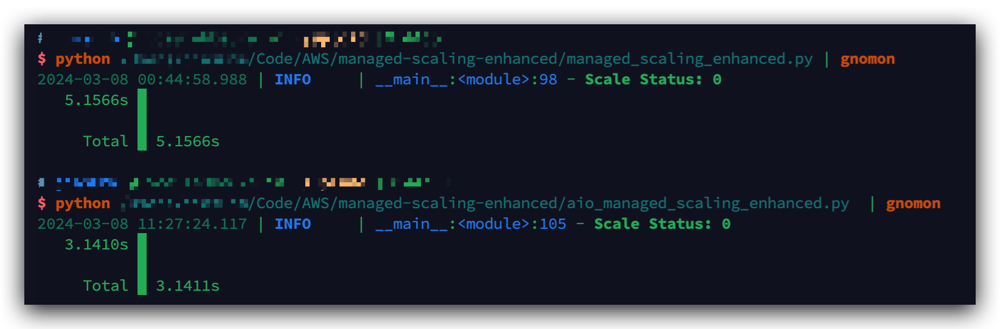

# managed-scaling-enhanced
An advanced version of managed scaling that dynamically adjusts resources to meet workload demands with improved efficiency and precision.


## 1. Enhanced Managed Scaling: Logic Flow Diagram


## 2. User Guide

### 2.1 Initialize the Parameter Store
Before using managed-scaling-enhanced, you need to initialize the Parameter Store.

```zsh
python create_parameter_store.py
```

Specific parameters
```python
    parameters = {
        f'{prefix}/minimumUnits': 320,  # max nuit 的最小值
        f'{prefix}/maximumUnits': 1000, # max nuit 的最大值

        f'{prefix}/spotInstancesTimeout': 60*30,
        f'{prefix}/monitorIntervalSeconds': 30,
        f'{prefix}/actionIntervalSeconds': 30,

        f'{prefix}/scaleOutAvgYARNMemoryAvailablePercentageValue': 20,
        f'{prefix}/scaleOutAvgYARNMemoryAvailablePercentageMinutes': 5,
        f'{prefix}/scaleOutAvgCapacityRemainingGBValue': 256,
        f'{prefix}/scaleOutAvgCapacityRemainingGBMinutes': 5,
        f'{prefix}/scaleOutAvgPendingAppNumValue': 3,
        f'{prefix}/scaleOutAvgPendingAppNumMinutes': 5,
        f'{prefix}/scaleOutAvgTaskNodeCPULoadValue': 60,
        f'{prefix}/scaleOutAvgTaskNodeCPULoadMinutes': 15,

        f'{prefix}/scaleInAvgYARNMemoryAvailablePercentageValue': 30,
        f'{prefix}/scaleInAvgYARNMemoryAvailablePercentageMinutes': 3,
        f'{prefix}/scaleInAvgCapacityRemainingGBValue': 512,
        f'{prefix}/scaleInAvgCapacityRemainingGBMinutes': 3,
        f'{prefix}/scaleInAvgPendingAppNumValue': 2,
        f'{prefix}/scaleInAvgPendingAppNumMinutes': 2,
        f'{prefix}/scaleInAvgTaskNodeCPULoadValue': 40,
        f'{prefix}/scaleInAvgTaskNodeCPULoadMinutes': 15,

        f'{prefix}/scaleOutFactor': 1.5,
        f'{prefix}/scaleInFactor': 1.7,   

        f'{prefix}/maximumOnDemandInstancesNumValue': 160,  # 针对defalut情况下：on_demand instance num = core node num         
    }
```
After execution, the parameter list can be seen in the Parameter Store.

You can create multiple distinct prefix parameters for configuring different clusters.

### 2.2. monitor
Before using managed-scaling-enhanced, first enable monitoring.


Two parameters are required: one is the cluster that needs to be monitored, and the other is the set of prefix parameters in the Parameter Store. 
You can initiate multiple monitoring processes, targeting different clusters with different configurations. 
This program saves the monitoring data in sqlite files named after the clusters, which are used for querying by the main program of managed-scaling-enhanced.
```zsh
$ python yarn_monitor.py --help                                                                
usage: yarn_monitor.py [-h] --emr-cluster-id EMR_CLUSTER_ID --prefix PREFIX

EMR YARN Metric Monitor

optional arguments:
  -h, --help            show this help message and exit
  --emr-cluster-id EMR_CLUSTER_ID
                        EMR cluster ID
  --prefix PREFIX       Parameter store prefix
```

### 2.3. managed-scaling-enhanced
Main program of Managed Scaling Enhanced

```zsh
$ python main.py --help                                                                    
usage: main.py [-h] --emr-id EMR_ID [--prefix PREFIX] [--spot-switch-on-demand SPOT_SWITCH_ON_DEMAND]

Managed Scaling Enhanced for EMR

options:
  -h, --help            show this help message and exit
  --emr-id EMR_ID       EMR cluster ID
  --prefix PREFIX       Parameter prefix (default: managedScalingEnhanced)
  --spot-switch-on-demand SPOT_SWITCH_ON_DEMAND
                        Whether to switch to on-demand instances (0: no, 1: yes, default: 0)
```
The main program will decide to scale out or scale in based on the logic of the architecture diagram, while also logging a record of the trigger time in sqlite for future condition judgment.

## appendix
### Performance Comparison Between Synchronous and Asynchronous Calls

Asynchronous call is 38.43% faster.


