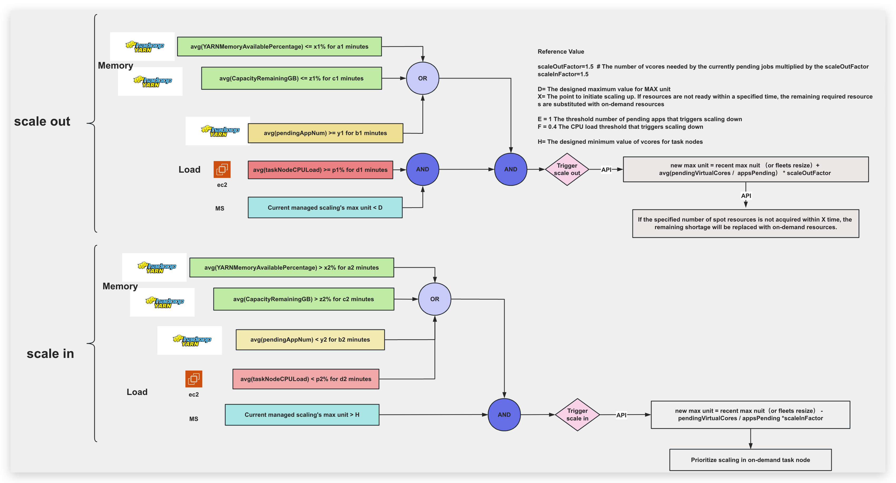
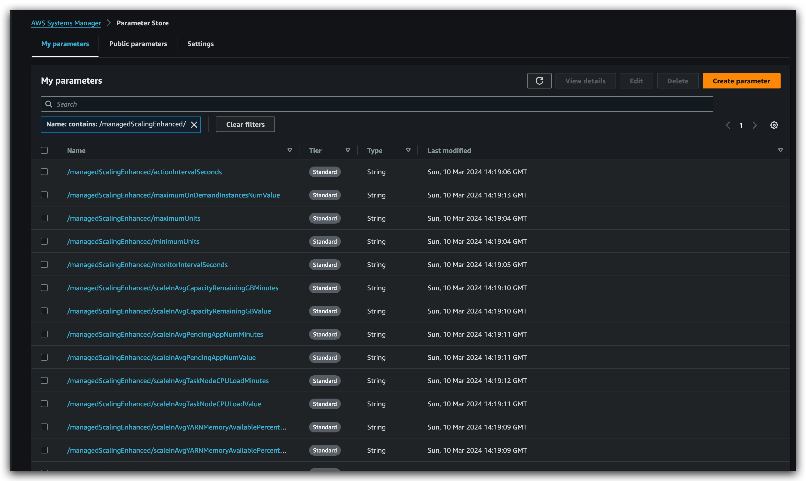

以下是readme.md的中文版本:

```md
# managed-scaling-enhanced
一个高级版本的managed scaling,可以动态调整资源以满足工作负载需求,提高效率和精度。

## 1. 增强型Managed Scaling:逻辑流程图


## 2. 用户指南

### 2.1 初始化参数存储
在使用managed-scaling-enhanced之前,您需要初始化参数存储。

```zsh
python create_parameter_store.py
```

具体参数
```python
    parameters = {
        f'{prefix}/minimumUnits': 320,  # max nuit 的最小值
        f'{prefix}/maximumUnits': 1000, # max nuit 的最大值

        f'{prefix}/spotInstancesTimeout': 60*30,
        f'{prefix}/monitorIntervalSeconds': 30,
        f'{prefix}/actionIntervalSeconds': 30,

        f'{prefix}/scaleOutAvgYARNMemoryAvailablePercentageValue': 33,
        f'{prefix}/scaleOutAvgYARNMemoryAvailablePercentageMinutes': 5,
        f'{prefix}/scaleOutAvgCapacityRemainingGBValue': 256,
        f'{prefix}/scaleOutAvgCapacityRemainingGBMinutes': 5,
        f'{prefix}/scaleOutAvgPendingAppNumValue': 3,
        f'{prefix}/scaleOutAvgPendingAppNumMinutes': 5,
        f'{prefix}/scaleOutAvgTaskNodeCPULoadValue': 60,
        f'{prefix}/scaleOutAvgTaskNodeCPULoadMinutes': 15,

        f'{prefix}/scaleInAvgYARNMemoryAvailablePercentageValue': 40,
        f'{prefix}/scaleInAvgYARNMemoryAvailablePercentageMinutes': 3,
        f'{prefix}/scaleInAvgCapacityRemainingGBValue': 512,
        f'{prefix}/scaleInAvgCapacityRemainingGBMinutes': 3,
        f'{prefix}/scaleInAvgPendingAppNumValue': 2,
        f'{prefix}/scaleInAvgPendingAppNumMinutes': 2,
        f'{prefix}/scaleInAvgTaskNodeCPULoadValue': 40,
        f'{prefix}/scaleInAvgTaskNodeCPULoadMinutes': 15,

        f'{prefix}/scaleOutFactor': 1.5,
        f'{prefix}/scaleInFactor': 1.7,   

        f'{prefix}/maximumOnDemandInstancesNumValue': 160,  # 针对defalut情况下：on_demand instance num = core node num   

        f'{prefix}/scaleOutCooldownSeconds': 60 * 7,
        f'{prefix}/scaleInCooldownSeconds': 60 * 5,      
    }
```
执行后,可以在参数存储中看到参数列表。

您可以为不同的集群配置创建多个不同的前缀参数。

#### 这些参数的意义和作用如下：

1. minimumUnits和maximumUnits:这两个参数分别设置了集群最大单元数量(MaximumCapacityUnits)的最小值和最大值。minimumUnits确保集群不会缩小到一定规模以下,而maximumUnits则限制了集群可以扩展到的最大规模。 
2. spotInstancesTimeout:这个参数指定了在补充On-Demand实例之前,需要查看过去多少秒内的MaximumCapacityUnits最小值。如果该最小值大于当前集群的totalVirtualCores,则需要补充On-Demand实例。 
3. monitorIntervalSeconds和actionIntervalSeconds:这两个参数分别指定了监控指标的获取间隔和执行扩缩容操作的间隔,单位为秒。 
4. scaleOutAvgYARNMemoryAvailablePercentageValue和scaleOutAvgYARNMemoryAvailablePercentageMinutes:这两个参数用于扩容操作。scaleOutAvgYARNMemoryAvailablePercentageValue设置了YARN可用内存百分比的阈值,如果该指标的平均值(在scaleOutAvgYARNMemoryAvailablePercentageMinutes指定的时间窗口内)低于该阈值,则满足扩容的内存条件之一。 
5. scaleOutAvgCapacityRemainingGBValue和scaleOutAvgCapacityRemainingGBMinutes:类似于上一条,这两个参数用于设置YARN剩余容量(GB)的阈值和时间窗口,如果该指标的平均值低于阈值,则满足扩容的内存条件之一。 
6. scaleOutAvgPendingAppNumValue和scaleOutAvgPendingAppNumMinutes:这两个参数用于设置待处理应用程序数量的阈值和时间窗口。如果该指标的平均值大于等于阈值,则满足扩容的应用程序条件。 
7. scaleOutAvgTaskNodeCPULoadValue和scaleOutAvgTaskNodeCPULoadMinutes:这两个参数用于设置任务节点CPU负载的阈值和时间窗口。如果该指标的平均值大于等于阈值,则满足扩容的CPU条件。 
8. scaleInAvg*参数:这些参数与上述scaleOut参数类似,但用于设置缩容操作的条件阈值和时间窗口。 
9. scaleOutFactor和scaleInFactor:这两个参数分别用于计算扩容和缩容时新的MaximumCapacityUnits值。扩容时,新值等于当前值加上(pending_virtual_cores / apps_pending) * scaleOutFactor或reserved_virtual_cores * scaleOutFactor。缩容时,新值等于max(minimumUnits, current_max_capacity_units - int((total_virtual_cores / apps_running) * scaleInFactor))。 
10. maximumOnDemandInstancesNumValue:这个参数设置了On-Demand实例的最大数量。在缩容操作中,会将MaximumOnDemandCapacityUnits设置为该值。 
11. scaleOutCooldownSeconds和scaleInCooldownSeconds:这两个参数分别设置了在执行扩容和缩容操作之后的冷却时间(秒)。在冷却时间内,不会执行相应的扩缩容操作。 


### 2.2. 监控
在使用managed-scaling-enhanced之前,首先启用监控。


需要两个参数:一个是需要监控的集群,另一个是参数存储中的前缀参数集。
您可以启动多个监控进程,针对不同的集群使用不同的配置。
该程序将监控数据保存在以集群命名的sqlite文件中,供managed-scaling-enhanced的主程序查询使用。
```zsh
$ python yarn_monitor.py --help                                                                
usage: yarn_monitor.py [-h] --emr-cluster-id EMR_CLUSTER_ID --prefix PREFIX

EMR YARN Metric Monitor

optional arguments:
  -h, --help            show this help message and exit
  --emr-cluster-id EMR_CLUSTER_ID
                        EMR cluster ID
  --prefix PREFIX       Parameter store prefix
```

### 2.3. managed-scaling-enhanced
Managed Scaling Enhanced的主程序

```zsh
$ python main.py --help                                                                    
usage: main.py [-h] --emr-id EMR_ID [--prefix PREFIX] [--spot-switch-on-demand SPOT_SWITCH_ON_DEMAND]

Managed Scaling Enhanced for EMR

options:
  -h, --help            show this help message and exit
  --emr-id EMR_ID       EMR cluster ID
  --prefix PREFIX       Parameter prefix (default: managedScalingEnhanced)
  --spot-switch-on-demand SPOT_SWITCH_ON_DEMAND
                        Whether to switch to on-demand instances (0: no, 1: yes, default: 0)
```
主程序将根据架构图的逻辑决定是扩展还是缩减,同时将触发时间的记录记录到sqlite中,供未来条件判断使用。

## 附录
### 核心类逻辑

`determine_scale_status`方法的逻辑如下:
a. 获取当前集群的`MaximumCapacityUnits`值。
b. 从SQLite数据库和CloudWatch指标中获取相关监控数据,包括:

* `YARNMemoryAvailablePercentage`(用于扩缩容)
* `CapacityRemainingGB`(用于扩缩容)
* `PendingAppNum`(用于扩缩容)
* 任务节点的CPU利用率(用于扩缩容,通过`get_task_node_metrics`方法获取)

c. 如果任何一个监控数据列表为空,则返回0(不执行扩缩容操作)。
d. 计算扩容(`scaleOut`)的单项条件状态:

* `scaleOutMemoryConditionYARNMemoryAvailablePercentageStatus`: `YARNMemoryAvailablePercentage`的均值是否低于阈值`scaleOutAvgYARNMemoryAvailablePercentageValue`
* `scaleOutMemoryConditionCapacityRemainingGBStatus`: `CapacityRemainingGB`的均值是否低于阈值`scaleOutAvgCapacityRemainingGBValue`
* `scaleOutAppConditionPendingAppNumStatus`: `PendingAppNum`的均值是否大于等于阈值`scaleOutAvgPendingAppNumValue`
* `scaleOutCPULoadStatus`: 任务节点CPU利用率的均值是否大于等于阈值`scaleOutAvgTaskNodeCPULoadValue`
* `scaleOutcurrentMaxUnitNumStatus`: 当前`MaximumCapacityUnits`是否小于`maximumUnits`

e. 计算扩容的综合条件:

* `scaleOutMemoryCondition`: `scaleOutMemoryConditionYARNMemoryAvailablePercentageStatus`或`scaleOutMemoryConditionCapacityRemainingGBStatus`为真
* `scaleOutPendingAppNumCondition`: `scaleOutAppConditionPendingAppNumStatus`为真
* `scaleOutCPULoadCondition`: `scaleOutCPULoadStatus`为真
* `scaleOutcurrentMaxUnitCondition`: `scaleOutcurrentMaxUnitNumStatus`为真
* `scaleOutCondition`: `scaleOutMemoryCondition`和`scaleOutPendingAppNumCondition`和`scaleOutCPULoadCondition`和`scaleOutcurrentMaxUnitCondition`均为真

f. 计算缩容(`scaleIn`)的单项条件状态:

* `scaleInMemoryConditionYARNMemoryAvailablePercentageStatus`: `YARNMemoryAvailablePercentage`的均值是否高于阈值`scaleInAvgYARNMemoryAvailablePercentageValue`
* `scaleInMemoryConditionCapacityRemainingGBStatus`: `CapacityRemainingGB`的均值是否高于阈值`scaleInAvgCapacityRemainingGBValue`
* `scaleInAppConditionPendingAppNumStatus`: `PendingAppNum`的均值是否小于阈值`scaleInAvgPendingAppNumValue`
* `scaleInCPULoadStatus`: 任务节点CPU利用率的均值是否小于阈值`scaleInAvgTaskNodeCPULoadValue`
* `scaleIncurrentMaxUnitNumStatus`: 当前`MaximumCapacityUnits`是否大于`minimumUnits`

g. 计算缩容的综合条件:

* `scaleInMemoryCondition`: `scaleInMemoryConditionYARNMemoryAvailablePercentageStatus`或`scaleInMemoryConditionCapacityRemainingGBStatus`为真
* `scaleInPendingAppNumCondition`: `scaleInAppConditionPendingAppNumStatus`为真
* `scaleInCPULoadCondition`: `scaleInCPULoadStatus`为真
* `scaleIncurrentMaxUnitCondition`: `scaleIncurrentMaxUnitNumStatus`为真
* `scaleInCondition`: (`scaleInMemoryCondition`或`scaleInPendingAppNumCondition`或`scaleInCPULoadCondition`)和`scaleIncurrentMaxUnitCondition`均为真

h. 根据`scaleOutCondition`和`scaleInCondition`的值确定扩缩容操作:

* 如果`scaleOutCondition`为真且`scaleInCondition`为假,则返回1(执行扩容)
* 如果`scaleOutCondition`为假且`scaleInCondition`为真,则返回-1(执行缩容)
* 否则返回0(不执行扩缩容操作)


`scale_out`方法的逻辑如下:
首先检查是否在冷却期内,如果是,则跳过扩容操作。
a. 获取当前集群的`pendingVirtualCores`和`appsPending`指标。
b. 如果`appsPending`为0,则直接返回,不执行扩容操作。
c. 获取当前的Managed Scaling策略,包括`MaximumCapacityUnits`和`MinimumCapacityUnits`。
d. 计算新的`MaximumCapacityUnits`值,公式为:
`new_max_capacity_units = current_max_capacity_units + int((pending_virtual_cores / apps_pending) * self.scaleOutFactor)`
e. 确保新的`MaximumCapacityUnits`值大于等于`MinimumCapacityUnits + 1`。
f. 确保新的`MaximumCapacityUnits`值不超过`self.maximumUnits`的最大限制。
g. 更新当前策略中的`MaximumCapacityUnits`为新计算的值。
h. 使用更新后的策略调用`emr_client.put_managed_scaling_policy`方法应用新策略。
i. 将新策略的`MaximumCapacityUnits`值记录到SQLite数据库中。
j. 如果`self.spot_switch_on_demand`为1,则检查是否需要补充On-Demand实例。具体做法是:

* 从SQLite数据库中获取过去`self.spotInstancesTimeout`秒内的最小`MaximumCapacityUnits`值。
* 如果该最小值大于当前集群的`totalVirtualCores`,则需要补充On-Demand实例。
* 计算需要补充的On-Demand实例数量。
* 更新当前策略中的`MaximumOnDemandCapacityUnits`。
* 应用更新后的策略。


`scale_in`方法的逻辑如下:
首先检查是否在冷却期内,如果是,则跳过缩容操作。
a. 获取当前集群的`pendingVirtualCores`和`appsPending`指标。
b. 获取当前的Managed Scaling策略,包括`MaximumCapacityUnits`和`MaximumCoreCapacityUnits`。
c. 如果`appsPending`为0,则将`MaximumCapacityUnits`设置为`self.minimumUnits`,并将`MaximumOnDemandCapacityUnits`设置为`self.maximumOnDemandInstancesNumValue`。
d. 如果`appsPending`不为0,则:

* 将`MaximumOnDemandCapacityUnits`设置为`self.maximumOnDemandInstancesNumValue`。
    * 为了与原始OnDemand设置保持一致,解决该值在扩容阶段调整的问题。
* 计算新的`MaximumCapacityUnits`值,公式为:
    `new_max_capacity_units = max(self.minimumUnits, current_max_capacity_units - int((pending_virtual_cores / apps_pending) * self.scaleInFactor))`
* 更新当前策略中的`MaximumCapacityUnits`为新计算的值。

e. 使用更新后的策略调用`emr_client.put_managed_scaling_policy`方法应用新策略。
f. 将新策略的`MaximumCapacityUnits`值记录到SQLite数据库中。
g. 获取当前集群的Instance Fleets列表。
h. 对于每个TASK类型的Instance Fleet:

* 将其`TargetOnDemandCapacity`设置为0。
* 将其`TargetSpotCapacity`设置为`MaximumCapacityUnits - MaximumCoreCapacityUnits`。
* 调用`emr_client.modify_instance_fleet`方法应用更改。


### 同步调用和异步调用性能对比

异步调用比同步调用快38.43%。


```